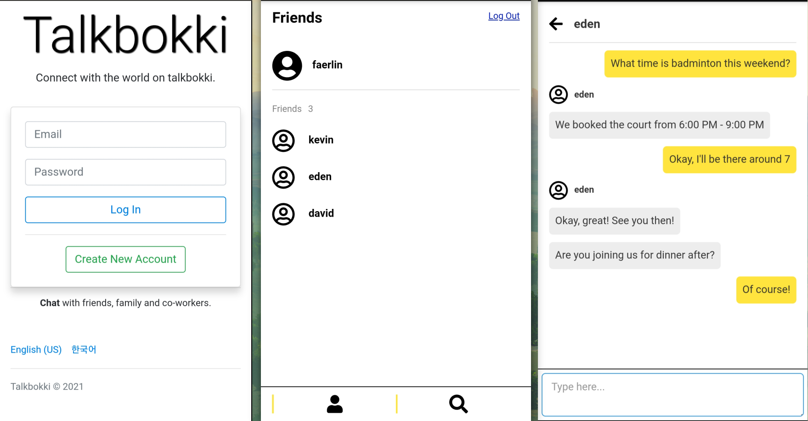

# Talkbokki

__Talkbokki__ is an instant messaging web application. Users can text and find their friends who are in the service. The application is deployed at [talkbokki.herokuapp.com](https://talkbokki.herokuapp.com).

## Built With

- [Node.js](https://nodejs.org/en/)
- [Express](http://expressjs.com/)
- [MongoDB](https://www.mongodb.com/)
- [Mongoose](https://mongoosejs.com/)
- [Socket.io](https://socket.io/)